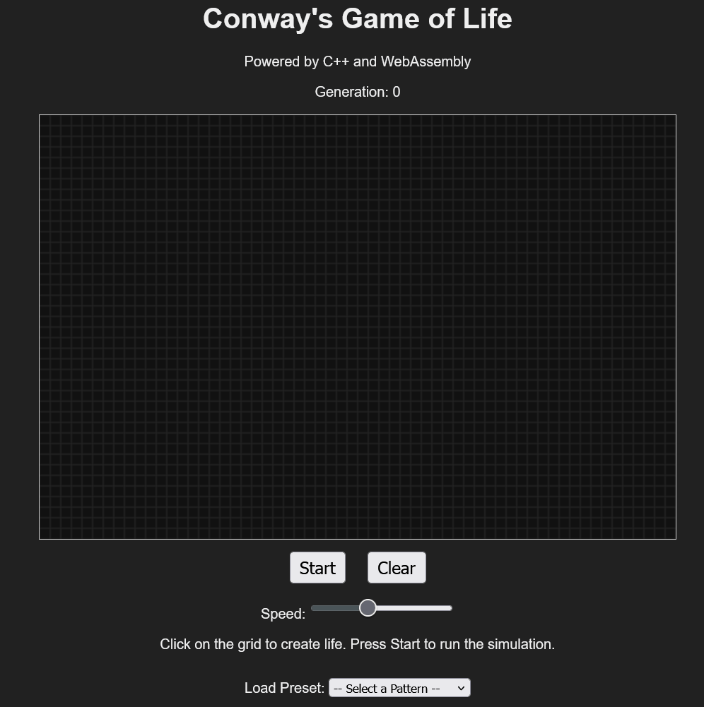

# Conway's Game of Life (C++ and WebAssembly)

<p align="center">
  
  
  
  
  
  
</p>
This is a web-based implementation of John Conway's Game of Life. The core simulation logic is written in modern C++ for high performance and compiled to WebAssembly (Wasm) using the Emscripten toolchain. The user interface is built with standard HTML, CSS, and JavaScript, providing an interactive canvas for drawing patterns and controlling the simulation.



## Features

- **High-Performance Engine:** The entire simulation logic runs at near-native speed in the browser thanks to C++ and WebAssembly.
- **Interactive Grid:** Draw and erase cells directly on the canvas with your mouse to create initial patterns.
- **Full Simulation Control:** Start, stop, and clear the simulation at any time.
- **Real-time Speed Adjustment:** Use the slider to control the speed of generations, from very slow to very fast.
- **Pattern Presets:** Instantly load classic patterns like the "Gosper Glider Gun" and "Pulsar" from a dropdown menu.
- **Live Feedback:** A generation counter updates in real-time as the simulation runs.

## Tech Stack

- **C++ :** Used for the core simulation engine (`engine.cpp`).
- **WebAssembly (Wasm):** The compilation target for the C++ code.
- **Emscripten SDK:** The toolchain used to compile C++ to Wasm and generate JavaScript glue code.
- **HTML5:** Provides the structure of the web page and the `<canvas>` element.
- **CSS3:** Used for styling the user interface.
- **JavaScript:** Acts as the "glue" code to bridge the HTML UI with the Wasm module, handling user input and rendering.

## Requirements

Before you begin, ensure you have the following installed on your system:

1.  **The Emscripten SDK:** This is the C++/Wasm compiler. Follow the official installation instructions at [emscripten.org/docs/getting_started/downloads.html](https://emscripten.org/docs/getting_started/downloads.html).
2.  **Python 3:** Required for running a simple local web server. Most systems have this pre-installed.
3.  **A modern web browser:** Chrome, Firefox, Edge, or Safari with support for WebAssembly.

## How to Build and Run

Follow these steps from your terminal to get the project running locally.

1.  **Clone the Repository**

    ```bash
    git clone https://github.com/0bVdnt/GameOfLife-WebAssembly.git
    cd GameOfLife-WebAssembly
    ```

2.  **Activate the Emscripten SDK**
    Navigate to the directory where you installed the SDK and run the environment script. You will need to do this in every new terminal session where you want to compile.
    _(Use the correct path for your system)_

    **On Linux or macOS:**

    ```bash
    source /path/to/your/emsdk/emsdk_env.sh
    ```

    **On Windows:**

    ```bash
    C:\path\to\your\emsdk\emsdk_env.bat
    ```

3.  **Compile the C++ to WebAssembly**
    From the root of the project directory, run the following `emcc` command. This compiles `engine.cpp` into `engine.wasm` and creates the necessary JavaScript loader `engine.js`.

    ```bash
    emcc engine.cpp -o engine.js -s WASM=1 -s "EXPORTED_RUNTIME_METHODS=['cwrap', 'HEAPU8']" -s "EXPORTED_FUNCTIONS=['_malloc', '_free']"
    ```

    This command may take a few moments to complete.

4.  **Start a Local Web Server**
    You cannot run the `index.html` file directly from your file system due to browser security policies (CORS). You must serve it over HTTP. A simple Python server is perfect for this.

    ```bash
    python3 -m http.server
    ```

    (If `python3` doesn't work, try `python`.)

5.  **View in Browser**
    Open your web browser and navigate to the following address:
    [http://localhost:8000](http://localhost:8000)

    You should now see the fully interactive Game of Life application!

## Project Structure

````

.
├── .gitignore # Tells Git which files to ignore
├── engine.cpp # The core C++ simulation logic
├── index.html # The main HTML file for the user interface
├── main.js # JavaScript glue code for UI and Wasm interaction
├── README.md # This file
│
└── # Generated Files (after compilation)
├── engine.js # The JavaScript loader generated by Emscripten
└── engine.wasm # The compiled C++ WebAssembly module

```
````
